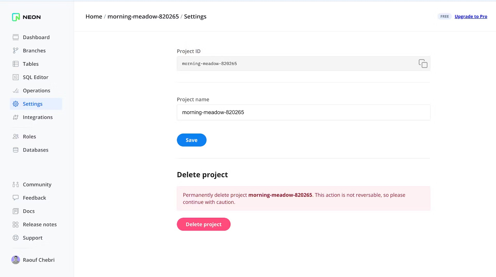

## Testing dbt project: `jaffle_shop_neon`

`jaffle_shop` is a fictional ecommerce store. This dbt project transforms raw data from an app database into a customers and orders model ready for analytics.

This is a fork of the original `jaffle_shop` project and designed to get you up and running with dbt as quickly as possible. It is not intended to be a demonstration of best practices, but rather a self-contained playground for testing out dbt and communicating some of the core dbt concepts with Neon Serverless Postgres and branching.

### Neon Project Setup & Build
> Note: Instructions derived from this blog post: [here](https://neon.tech/blog/automating-neon-branch-creation-with-githooks)
- Sign up for a Neon account: [here](https://neon.tech/docs/get-started-with-neon/signing-up)
- Create your first project: [here](https://neon.tech/docs/get-started-with-neon/setting-up-a-project)

Add the following environment variables to your project `.env` file:

> Checkout [`.env_example`](.env_example) for reference

```bash
export NEON_PROJECT_ID=<project_id>
export NEON_API_KEY=<api_key>
```

How to get `NEON_PROJECT_ID` and `NEON_API_KEY`:

<div style="width:100%;height:0;padding-bottom:56%;position:relative;"><iframe src="https://giphy.com/embed/fNylARnV0Rv0jzBkDm" width="100%" height="100%" style="position:absolute" frameBorder="0" class="giphy-embed" allowFullScreen></iframe></div><p><a href="https://giphy.com/gifs/fNylARnV0Rv0jzBkDm">via GIPHY</a></p>

```bash
# run the following commands to see everything in action
python -m venv venv # create virtual environment
source venv/bin/activate # activate virtual environment
pip install --upgrade pip # upgrade pip
pip install -r requirements.txt # install dbt requirements
source venv/bin/activate # activate virtual environment
brew install jq # parse json to interact with neon api payloads
cp git_hooks/post-checkout .git/hooks/ # script to create neon branch on git checkout
git checkout -b custom_branch_$RANDOM # test it out
source .env # load new environment variables
dbt debug # verify dbt is configured correctly
dbt build # the part you've been waiting for
```

You should see the following output to verify neon branching was successful:

```bash
Switched to a new branch 'custom_branch_861'
PROJECT_ID: empty-grass-954313
Do you want to create a Neon branch for custom_branch_861? (y/n): y
---These are your development profile environment variables---
HOST: ep-green-tree-388906.us-west-2.aws.neon.tech
ROLE: sungwonchung3
DBNAME: neondb
PASSWORD: <hidden>
```

### What is this repo?
What this repo _is_:
- A self-contained playground dbt project, useful for testing out scripts, and communicating some of the core dbt concepts.

What this repo _is not_:
- A tutorial — check out the [Getting Started Tutorial](https://docs.getdbt.com/tutorial/setting-up) for that. Notably, this repo contains some anti-patterns to make it self-contained, namely the use of seeds instead of sources.
- A demonstration of best practices — check out the [dbt Learn Demo](https://github.com/dbt-labs/dbt-learn-demo) repo instead. We want to keep this project as simple as possible. As such, we chose not to implement:
    - our standard file naming patterns (which make more sense on larger projects, rather than this five-model project)
    - a pull request flow
    - CI/CD integrations
- A demonstration of using dbt for a high-complex project, or a demo of advanced features (e.g. macros, packages, hooks, operations) — we're just trying to keep things simple here!

### What's in this repo?
This repo contains [seeds](https://docs.getdbt.com/docs/building-a-dbt-project/seeds) that includes some (fake) raw data from a fictional app.

The raw data consists of customers, orders, and payments, with the following entity-relationship diagram:


### Running this project
To get up and running with this project:
1. Install dbt using [these instructions](https://docs.getdbt.com/docs/installation).

2. Clone this repository.

3. Change into the `jaffle_shop` directory from the command line:
```bash
$ cd jaffle_shop
```

4. Set up a profile called `jaffle_shop` to connect to a data warehouse by following [these instructions](https://docs.getdbt.com/docs/configure-your-profile). If you have access to a data warehouse, you can use those credentials – we recommend setting your [target schema](https://docs.getdbt.com/docs/configure-your-profile#section-populating-your-profile) to be a new schema (dbt will create the schema for you, as long as you have the right privileges). If you don't have access to an existing data warehouse, you can also setup a local postgres database and connect to it in your profile.

5. Ensure your profile is setup correctly from the command line:
```bash
$ dbt debug
```

6. Load the CSVs with the demo data set. This materializes the CSVs as tables in your target schema. Note that a typical dbt project **does not require this step** since dbt assumes your raw data is already in your warehouse.
```bash
$ dbt seed
```

7. Run the models:
```bash
$ dbt run
```

> **NOTE:** If this steps fails, it might mean that you need to make small changes to the SQL in the models folder to adjust for the flavor of SQL of your target database. Definitely consider this if you are using a community-contributed adapter.

8. Test the output of the models:
```bash
$ dbt test
```

9. Generate documentation for the project:
```bash
$ dbt docs generate
```

10. View the documentation for the project:
```bash
$ dbt docs serve
```

### What is a jaffle?
A jaffle is a toasted sandwich with crimped, sealed edges. Invented in Bondi in 1949, the humble jaffle is an Australian classic. The sealed edges allow jaffle-eaters to enjoy liquid fillings inside the sandwich, which reach temperatures close to the core of the earth during cooking. Often consumed at home after a night out, the most classic filling is tinned spaghetti, while my personal favourite is leftover beef stew with melted cheese.

---
For more information on dbt:
- Read the [introduction to dbt](https://docs.getdbt.com/docs/introduction).
- Read the [dbt viewpoint](https://docs.getdbt.com/docs/about/viewpoint).
- Join the [dbt community](http://community.getdbt.com/).
---
